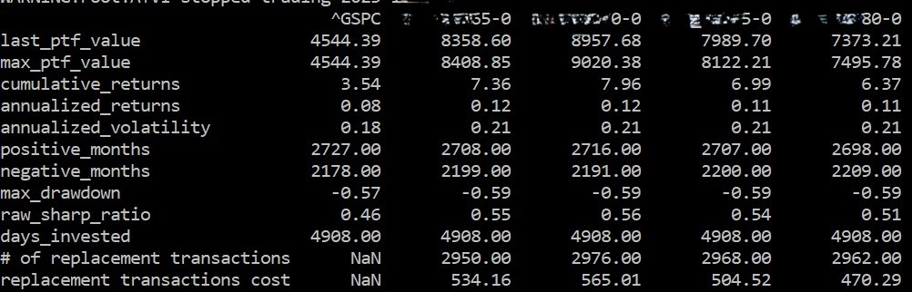
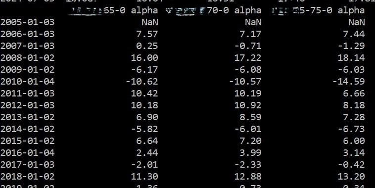
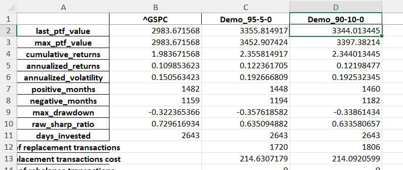
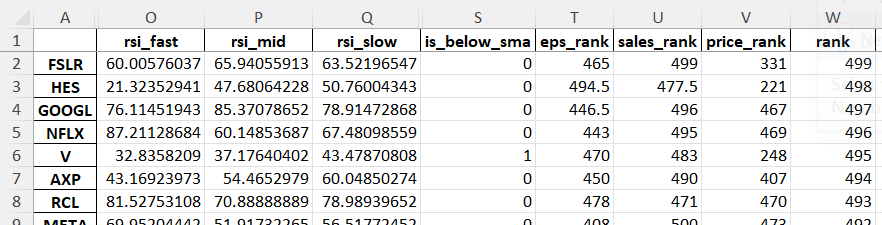
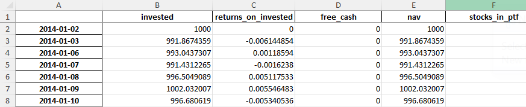

# Project Quanta-Demo

<a href="https://financialmodelingprep.com/developer/docs/">Data provided by Financial Modeling Prep</a>

This Demo is the simplified to few metrics version prepared only for code presentation purpose.
(the production versions and configs cannot be publicly shared). Therefore none of git
and github history is available for this repo. Project, issues/pull requestes can be
presented during the inverview if required.

This piece of software is being developed to backtest selected strategies on groups of stocks
belonging to biggest stock exchange indices like S&P 500 or Nasdaq. It simulates real
behavior of a portfolio manager replacing stocks in portfolio every given interval, e.g.
once a month so they are falling into top ranked ones all the time. 

This is the MVP stage meant for quick testing various strategies, with no focus on user experience or efficiency at this statge. Web user interface will be applied in later stage. This is the project is being developed for the real fund manager and fin data analyst from London City.

For conviniece demo backtest part can be run without having API_KEY, the rank imput data are already in the repo.

### Requirements.
- Docker installed
- Internet connection
- API KEY to authenticate requests (not required for this demo).

### RUN the app
- Clone the git repo
```
git clone https://github.com/raf-lim/quanta-demo.git
```
- Create ".env" file in root folder according to .env_sample (for demo you can just rename .env_sample)
- Adjust settings in config.toml and rank_scenarios.toml config files (skip for demo).
- Build docker image and spin the app container:
```
docker compose up -d
```
For development version entrypoint.sh will create 2 folders "files_repo" and "files_output" in root folder if not existing.

- The app should be ready to use. You can run the command line in docker, eg.:
```
docker exec -it quanta-demo-dev bash
```
- Check the options and to run actions:
```
python main.py -h
```
- To run actions use "python main.py" + option flags
Before running actions check the config.toml file and change set up if needed.
(skip for Demo, no need to change config files)

### Actions to run
For this demo (no API_KEY) just skip --get_. The input files are already created in files_repo folder

For normal use:
- Collect input data required to create stocks data for ranking.
WARNING: running --get_prices will remove prices.db and recreates new empty database before loaded with neew data.
```
python main.py --get_tickers --get_fs --get_prices
```
The actions can be run also separatelly if needed (e.g. API errors).

For this demo you can skip --rank_input. To save time on the demo, the input file is already created in files_repo folder

For normal use:
- Compute and save the input data for rankings (here creates json file in files_repo folder).
```
python main.py --rank_input
```

- Run the backtest with selected strategy (plugins) and scenarios (.toml). It prints some performance metrics on the screen as well as .xlsx files with details can be created (select "y" for user input in the terminal when asked). Backtest scenarios can be set in rank_scenarios.toml
```
python main.py --backtest
```
The backtest results will be printed on the screen:




After the backtest results are printed on the screen you will be asked for saving the files:
Enter "y" to save desired file just push enter to skip.

- backtests for various scenarios set in rank_scenarios.toml



- ranked stocks data (separate file for each scenario)



- full performance detail every day (recommended to select 1 scenario in no need for more)




### Concepts
### RANK
Computing the ranked stocks data for each "stocks' replacement" period goes through the following steps:
1. Get the current and historical symbols
2. Find out the sybmols in the index valid for each period back. Last date of the period becomes the key for further computations (at this stage, for dev purposes, data are being stored in json file)
3. Loop through each period and rank stocks acc. to the scoring patern.
4. Set the start_rank_date var in main.py (at later stage it will be set by the user input).

### PORTFOLIO PERFORMANCE
1. Based on ranked data get tickers in portfolio for each trading day
2. Compute returns of each ticker each day and combine it into entire portfolio returns.
3. Check the difference in tickers sets for each day. If the difference exists replace tickers in portfolio accordingly. Sell (release cash) if the stopped trading in between replacement days and store cash till next replacement (just few ocurrences).
4. Portfolio returns are computed based on the total capital change (capital invested in stocks + cash if exists)

### BACKTESTING portfolio with no hedging strategies:
- daily returns are computed based on today's open vs yesterday's open
- stocks are being replaced on the first trading day of new period at open. Released capital from sold stocks is reinvested in new stocks coming to portfolio.
- backtest can be run with or without rebalancing (getting back to equal weight every month).
- set the scenarios_name var in main.py (at later stage it will be set by the user input)


[def]: URL